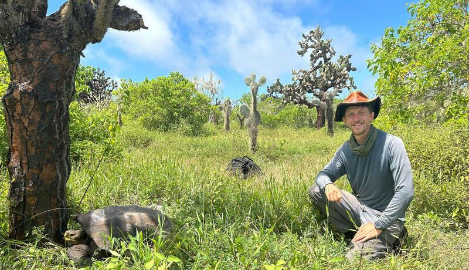
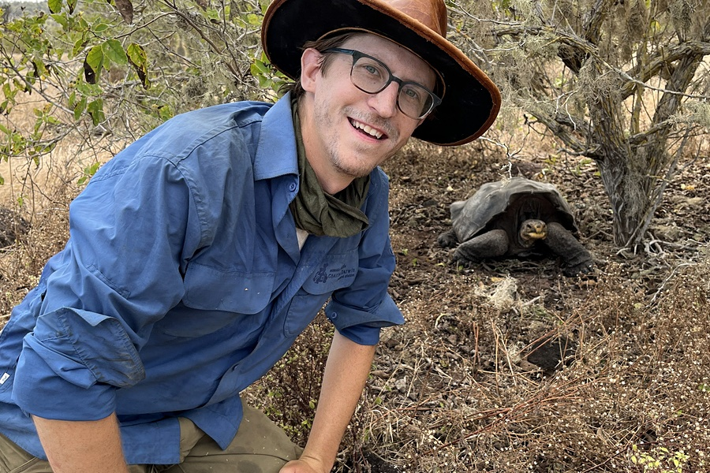
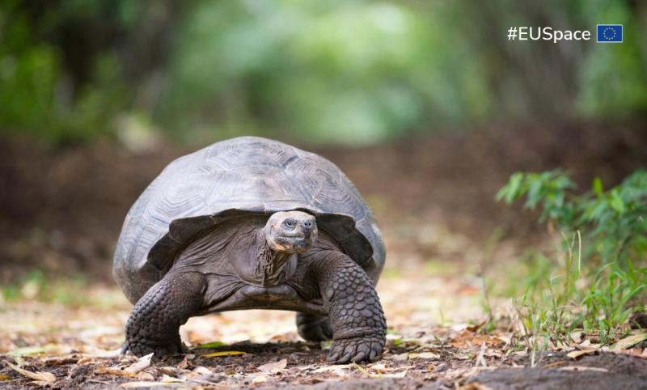
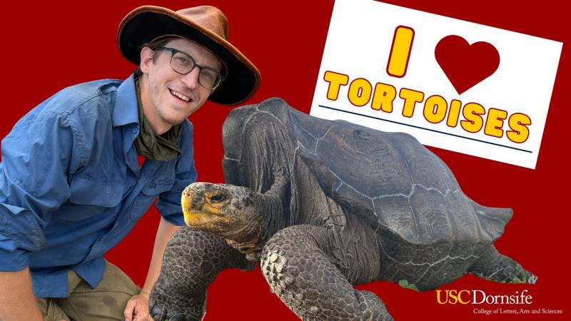
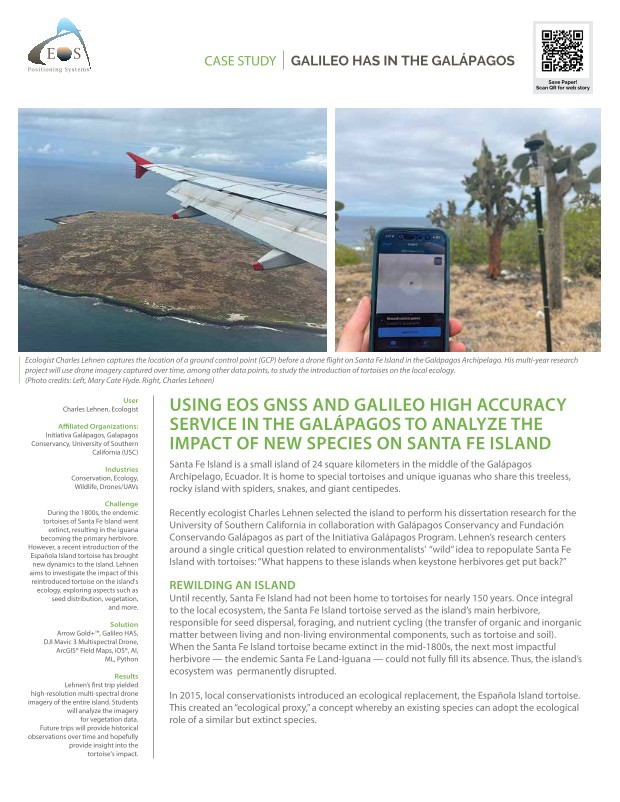
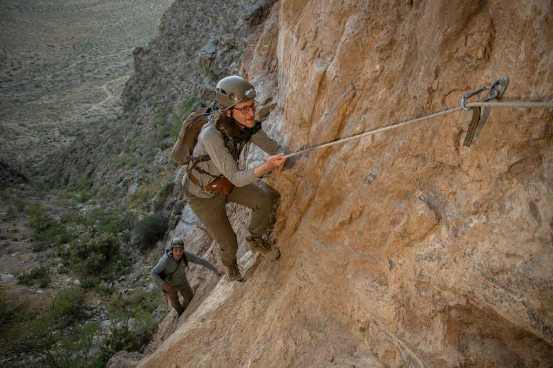
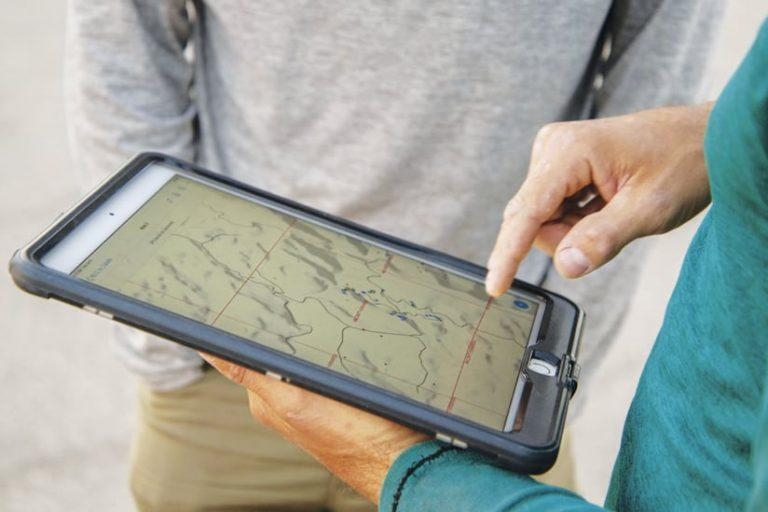

Research and teaching work featured in press, institutional profiles, and industry publications — from satellite navigation agencies to science communication outlets.

<!-- 1: USC CET -->
<a class="media-card" href="https://cet.usc.edu/what-a-great-teaching-idea-ta-edition-supporting-student-engagement/?_thumbnail_id=10130" target="_blank" rel="noopener">
  
  
Image coming soon

  

    USC CETArticle
    
"What a Great Teaching Idea: Supporting Student Engagement"

    
Featured by USC's Center for Excellence in Teaching for developing active learning strategies and evidence-based pedagogy in ecology and biology courses, including quantitative programming curricula built from the ground up.

  

</a>

<!-- 2: UMN Making of a Field Ecologist -->
<a class="media-card" href="https://twin-cities.umn.edu/news-events/making-field-ecologist" target="_blank" rel="noopener">
  
  
Image coming soon

  

    University of MinnesotaProfile
    
"The Making of a Field Ecologist"

    
The University of Minnesota profiles how formative experiences — from bat surveys in New Mexico to a Galápagos National Park internship — set the course for doctoral research in community ecology and conservation biology.

  

</a>

<!-- 3: Dean's Scholars Spotlight -->
<a class="media-card" href="https://cbs.umn.edu/blog-posts/charles-lehnen" target="_blank" rel="noopener">
  
  
Image coming soon

  

    UMN College of Biological SciencesAlumni Spotlight
    
"Dean's Scholars Alumni Spotlight: Charles Lehnen"

    
Recognized by the UMN College of Biological Sciences as a Dean's Scholar, this profile traces the path from undergraduate immunology research to field ecology across the Americas and the Galápagos.

  

</a>

<!-- 4: EUSPA Galileo -->
<a class="media-card" href="https://www.euspa.europa.eu/newsroom-events/news/galileo-has-galapagos-tortoise" target="_blank" rel="noopener">
  
  
Image coming soon

  

    EU Agency for the Space ProgrammeArticle
    
"Reviving Ecosystems: How Galileo High Accuracy Service Aids Galápagos Tortoise Reintroduction"

    
The European Union Agency for the Space Programme highlights how centimeter-accurate GNSS positioning tracks the movements of reintroduced <em>Chelonoidis hoodensis</em> across Santa Fe Island, enabling the first fine-scale habitat use study of rewilded tortoises in the archipelago.

  

</a>

<!-- 5: USC Dornsife Video -->
<a class="media-card" href="https://www.youtube.com/watch?v=fTj72Qwsl0U" target="_blank" rel="noopener">
  
  
Image coming soon

  

    USC DornsifeVideo
    
"Tortoise Research: From USC to Galápagos"

    
A short documentary from USC Dornsife College of Letters, Arts and Sciences following fieldwork across the Galápagos, capturing the scale of the Santa Fe Island tortoise reintroduction project and the international team of researchers and partners working to restore a long-absent ecological role.

  

</a>

<!-- 6: WonderKids -->
<a class="media-card" href="https://tinu.be/wonderkids_youtube" target="_blank" rel="noopener">
  
  
Image coming soon

  

    USC JEP STEM ProgramsVideo Series
    
"USC WonderKids Program Videos"

    
A video series documenting the USC JEP STEM WonderKids afterschool program — a semester-long virtual curriculum designed to expose K–5 students to diverse scientific careers through guest speakers, lab tours, and hands-on experiments from scientists across disciplines and backgrounds.

  

</a>

<!-- 7: EOS GNSS Galapagos -->
<a class="media-card" href="https://eos-gnss.com/successes/galapagos" target="_blank" rel="noopener">
  
  
Image coming soon

  

    EOS GNSSArticle
    
"Do Giant Tortoises Make Good Neighbors?"

    
EOS GNSS profiles the use of high-accuracy GPS receivers to monitor newly reintroduced Española Giant Tortoises on Santa Fe Island — documenting movement ecology, habitat selection, and inter-individual variation across the first seasons of the reintroduction.

  

</a>

<!-- 8: Esri ArcNews Bats -->
<a class="media-card" href="https://www.esri.com/about/newsroom/arcnews/where-the-bats-go" target="_blank" rel="noopener">
  
  
Image coming soon

  

    Esri ArcNewsArticle
    
"Where the Bats Go: New Research Uncovers Their Mysterious Journey"

    
Esri's flagship publication ArcNews features the New Mexico abandoned mines bat survey project, describing how GIS, LiDAR, and remote sensing identified potential roost sites and flyways across hundreds of kilometers of historic mining terrain in collaboration with Bat Conservation International.

  

</a>

<!-- 9: EOS GNSS Bats -->
<a class="media-card" href="https://eos-gnss.com/successes/bat-conservation-international" target="_blank" rel="noopener">
  
  
Image coming soon

  

    EOS GNSSArticle
    
"Bat Conservation International: Successes"

    
EOS GNSS highlights the Bat Conservation International project in which GPS receivers were used to document bat movement patterns and assess abandoned New Mexican mine shafts as potential roosting habitat, flyover corridors, and hibernacula — work that included nose-swab screening for white-nose syndrome pathogen.

  

</a>

