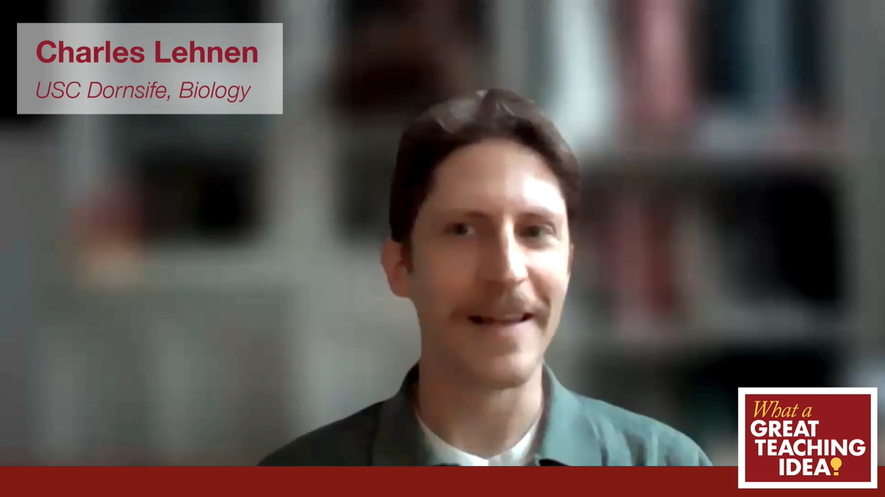

```{=html}
<style>
.media-grid {
  display: grid;
  grid-template-columns: repeat(3, 1fr);
  gap: 1.5rem;
  margin-top: 1.5rem;
}
@media (max-width: 992px) {
  .media-grid { grid-template-columns: repeat(2, 1fr); }
}
@media (max-width: 576px) {
  .media-grid { grid-template-columns: 1fr; }
}
.media-card {
  background: #fff;
  border: 1px solid #dee2e6;
  border-radius: 6px;
  overflow: hidden;
  display: flex;
  flex-direction: column;
  transition: box-shadow 0.2s ease, transform 0.2s ease;
  text-decoration: none;
  color: inherit;
}
.media-card:hover {
  box-shadow: 0 4px 16px rgba(0,0,0,0.13);
  transform: translateY(-2px);
  text-decoration: none;
  color: inherit;
}
.media-card-img {
  width: 100%;
  aspect-ratio: 16 / 9;
  object-fit: cover;
  display: block;
}
.media-card-img-placeholder {
  width: 100%;
  aspect-ratio: 16 / 9;
  background: #e9ecef;
  display: flex;
  align-items: center;
  justify-content: center;
  color: #adb5bd;
  font-size: 0.85rem;
}
.media-card-body {
  padding: 1rem 1.1rem 1.2rem;
  display: flex;
  flex-direction: column;
  flex: 1;
}
.media-badge-row {
  display: flex;
  align-items: center;
  gap: 5px;
  flex-wrap: wrap;
  margin-bottom: 0.5rem;
}
.media-outlet-badge {
  display: inline-block;
  font-size: 0.68rem;
  font-weight: 600;
  text-transform: uppercase;
  letter-spacing: 0.05em;
  color: #fff;
  background: #2c3e50;
  border-radius: 3px;
  padding: 2px 7px;
}
.media-type-tag {
  display: inline-block;
  font-size: 0.68rem;
  font-weight: 600;
  text-transform: uppercase;
  letter-spacing: 0.04em;
  border-radius: 3px;
  padding: 2px 6px;
}
.tag-video   { background: #c0392b; color: #fff; }
.tag-article { background: #2980b9; color: #fff; }
.tag-profile { background: #7d3c98; color: #fff; }
.media-card-title {
  font-size: 0.95rem;
  font-weight: 600;
  line-height: 1.35;
  color: #18bc9c;
  margin-bottom: 0.5rem;
}
.media-card:hover .media-card-title { text-decoration: underline; }
.media-card-blurb {
  font-size: 0.85rem;
  color: #555;
  line-height: 1.55;
  flex: 1;
}
.section-intro {
  max-width: 700px;
  color: #444;
  font-size: 0.97rem;
  line-height: 1.65;
  margin-bottom: 0.25rem;
}
</style>

<p class="section-intro">Research and teaching work featured in press, institutional profiles, and industry publications — from a satellite navigation agency of the European Union to science communication outlets.</p>

<div class="media-grid">

<!-- 1: USC CET -->
<a class="media-card" href="https://cet.usc.edu/what-a-great-teaching-idea-ta-edition-supporting-student-engagement/?_thumbnail_id=10130" target="_blank" rel="noopener">
  
  <div class="media-card-body">
    <div class="media-badge-row">
      <span class="media-outlet-badge">USC CET</span>
      <span class="media-type-tag tag-profile">Profile</span>
    </div>
    <div class="media-card-title">"What a Great Teaching Idea: Supporting Student Engagement"</div>
    <div class="media-card-blurb">Charles Lehnen shares how he builds genuine community in his sections and courses, and the strategies he relies on to keep students engaged and participating — centering on a space where students feel safe thinking out loud, even when that means getting things wrong.</div>
  </div>
</a>

<!-- 2: UMN Making of a Field Ecologist -->
<a class="media-card" href="https://twin-cities.umn.edu/news-events/making-field-ecologist" target="_blank" rel="noopener">
  
  <div class="media-card-body">
    <div class="media-badge-row">
      <span class="media-outlet-badge">University of Minnesota</span>
      <span class="media-type-tag tag-profile">Profile</span>
    </div>
    <div class="media-card-title">"The Making of a Field Ecologist"</div>
    <div class="media-card-blurb">The University of Minnesota profiles how a pre-med background, a career pivot, and formative experiences across New Mexico, Nevada, and the Galápagos set the trajectory for doctoral research in community ecology and conservation biology.</div>
  </div>
</a>

<!-- 3: Dean's Scholars Spotlight -->
<a class="media-card" href="https://cbs.umn.edu/blog-posts/charles-lehnen" target="_blank" rel="noopener">
  
  <div class="media-card-body">
    <div class="media-badge-row">
      <span class="media-outlet-badge">UMN College of Biological Sciences</span>
      <span class="media-type-tag tag-profile">Alumni Spotlight</span>
    </div>
    <div class="media-card-title">"Dean's Scholars Alumni Spotlight: Charles Lehnen"</div>
    <div class="media-card-blurb">Recognized by the University of Minnesota College of Biological Sciences as a Dean's Scholar, this profile traces the path from undergraduate immunology research to field ecology across three continents — and to the Galápagos Islands.</div>
  </div>
</a>

<!-- 4: EUSPA Galileo -->
<a class="media-card" href="https://www.euspa.europa.eu/newsroom-events/news/galileo-has-galapagos-tortoise" target="_blank" rel="noopener">
  
  <div class="media-card-body">
    <div class="media-badge-row">
      <span class="media-outlet-badge">EU Agency for the Space Programme</span>
      <span class="media-type-tag tag-article">Article</span>
    </div>
    <div class="media-card-title">"Reviving Ecosystems: How Galileo High Accuracy Service Aids Galápagos Tortoise Reintroduction"</div>
    <div class="media-card-blurb">Using the Galileo High Accuracy Service (HAS), Charles Lehnen achieves unprecedented precision in ecological monitoring on Santa Fe Island, enhancing conservation strategies and understanding of the reintroduced Española Island tortoise ecosystem dynamics.</div>
  </div>
</a>

<!-- 5: USC Dornsife Video -->
<a class="media-card" href="https://www.youtube.com/watch?v=fTj72Qwsl0U" target="_blank" rel="noopener">
  
  <div class="media-card-body">
    <div class="media-badge-row">
      <span class="media-outlet-badge">USC Dornsife</span>
      <span class="media-type-tag tag-video">Video</span>
    </div>
    <div class="media-card-title">"Tortoise Research: From USC to Galápagos"</div>
    <div class="media-card-blurb">Lehnen and his team spent a month on Santa Fe Island in the Galápagos researching tortoises, their diets, and surrounding ecosystems. Hear from Lehnen about how this research could inform the study of other endangered species around the world.</div>
  </div>
</a>

<!-- 6: EOS GNSS Galapagos -->
<a class="media-card" href="https://eos-gnss.com/successes/galapagos" target="_blank" rel="noopener">
  
  <div class="media-card-body">
    <div class="media-badge-row">
      <span class="media-outlet-badge">EOS GNSS</span>
      <span class="media-type-tag tag-article">Case Study</span>
    </div>
    <div class="media-card-title">"Do Giant Tortoises Make Good Neighbors?"</div>
    <div class="media-card-blurb">EOS GNSS profiles the use of the Arrow Gold+ receiver with Galileo HAS for collecting high-accuracy ground control points on Santa Fe Island — an approach that enhances the study of ecological restoration after a 150-year absence of tortoises from the island.</div>
  </div>
</a>

<!-- 7: Esri ArcNews Bats -->
<a class="media-card" href="https://www.esri.com/about/newsroom/arcnews/where-the-bats-go" target="_blank" rel="noopener">
  
  <div class="media-card-body">
    <div class="media-badge-row">
      <span class="media-outlet-badge">Esri ArcNews</span>
      <span class="media-type-tag tag-article">Article</span>
    </div>
    <div class="media-card-title">"Where the Bats Go: New Research Uncovers Their Mysterious Journey"</div>
    <div class="media-card-blurb">Esri's flagship publication features the New Mexico abandoned mines bat project — describing how GIS, LiDAR, and remote sensing identified potential roost sites and flyways across historic mining terrain in collaboration with Bat Conservation International.</div>
  </div>
</a>

<!-- 8: EOS GNSS Bats -->
<a class="media-card" href="https://eos-gnss.com/successes/bat-conservation-international" target="_blank" rel="noopener">
  
  <div class="media-card-body">
    <div class="media-badge-row">
      <span class="media-outlet-badge">EOS GNSS</span>
      <span class="media-type-tag tag-article">Case Study</span>
    </div>
    <div class="media-card-title">"Bat Conservation International: Successes"</div>
    <div class="media-card-blurb">Bat Conservation International employs a high-accuracy GIS-based workflow to assess potential bat habitats in abandoned New Mexican mines — documenting roosting sites, flyover corridors, and hibernacula with GPS receivers and LiDAR across hundreds of kilometers of terrain.</div>
  </div>
</a>

</div>
```
